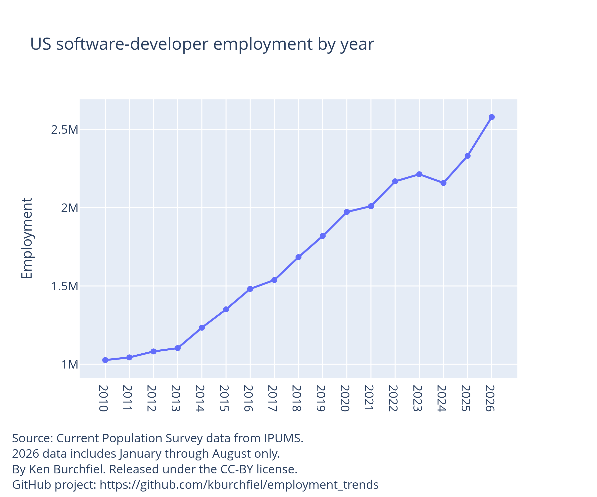
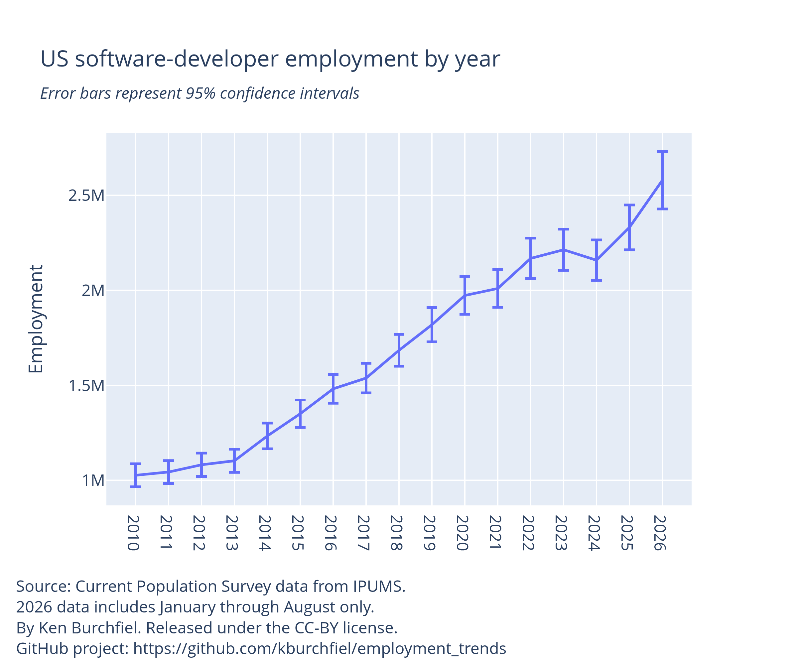
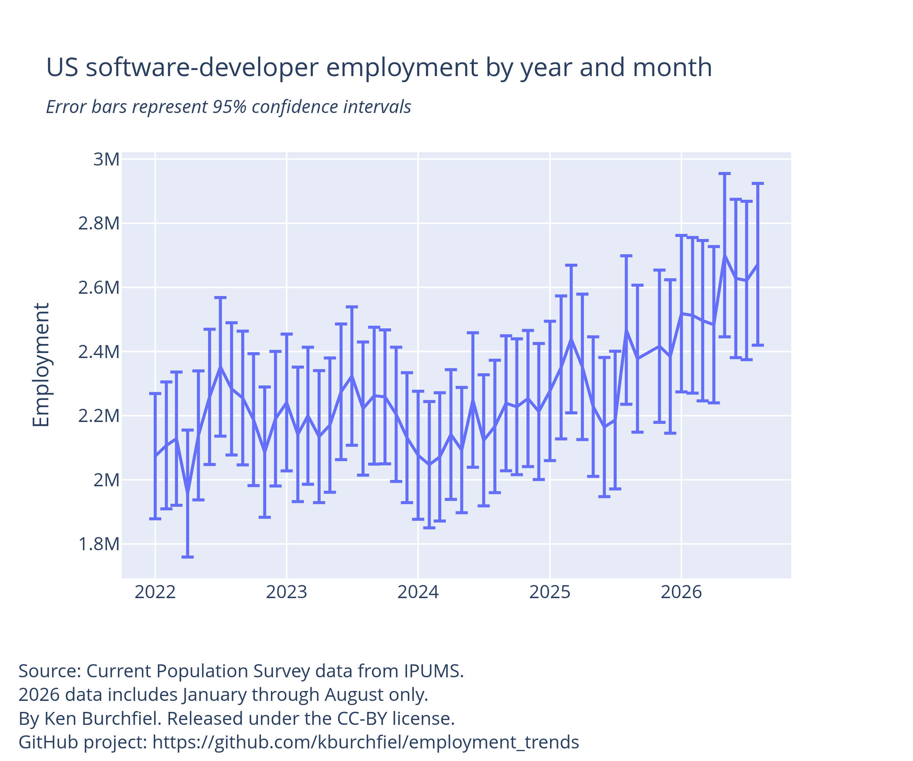
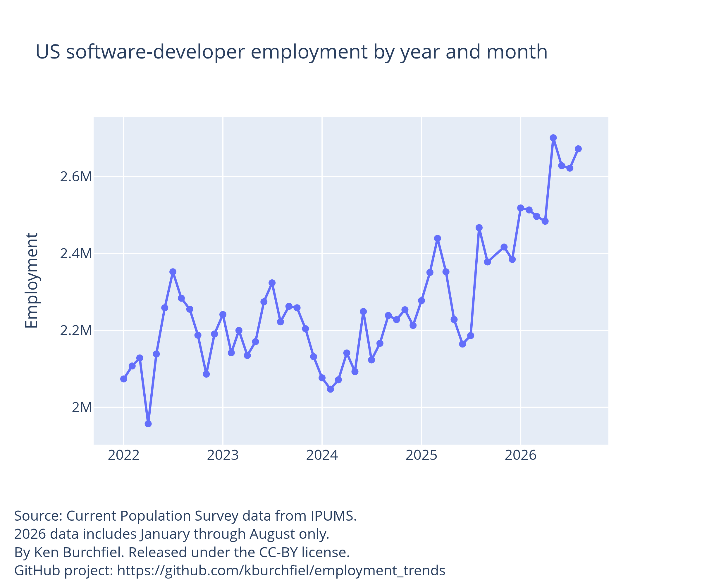
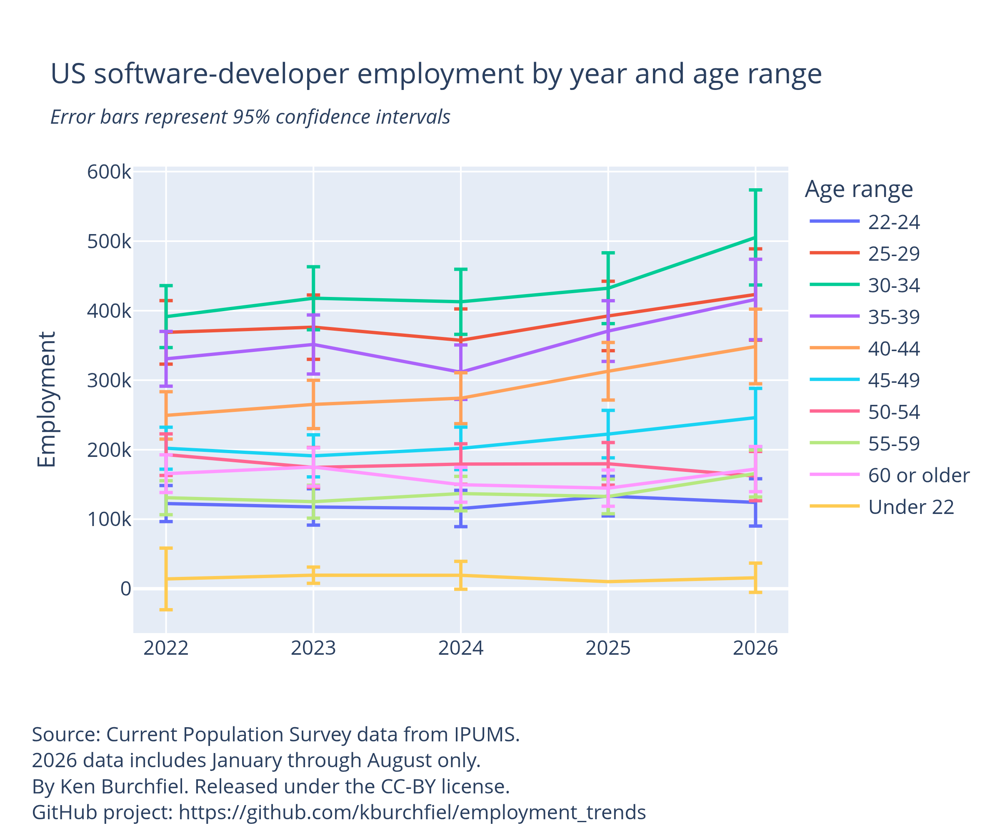
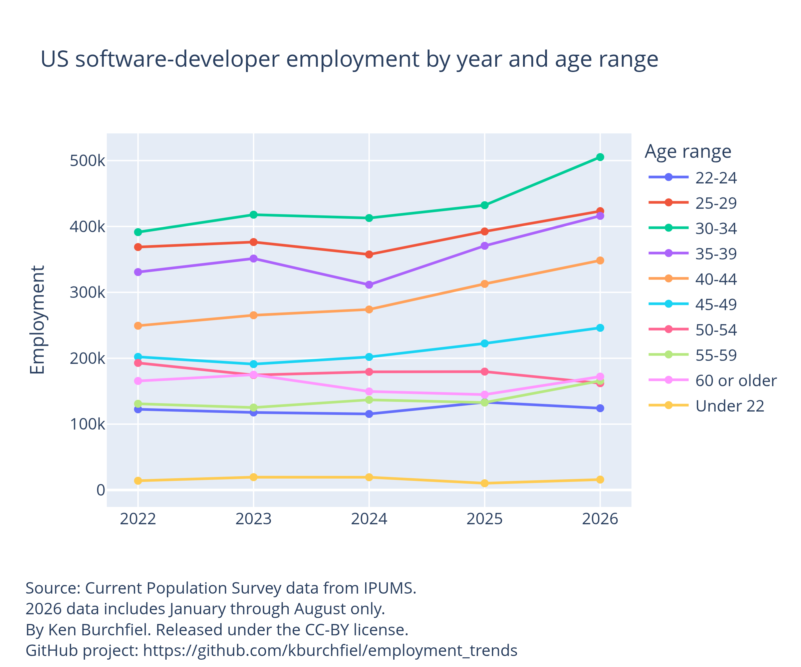
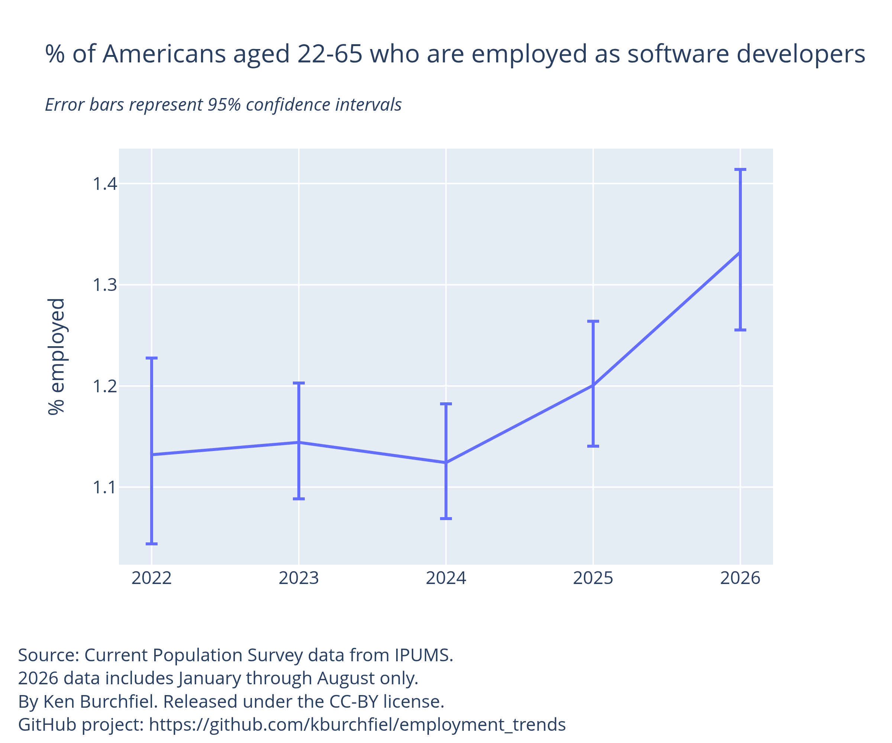
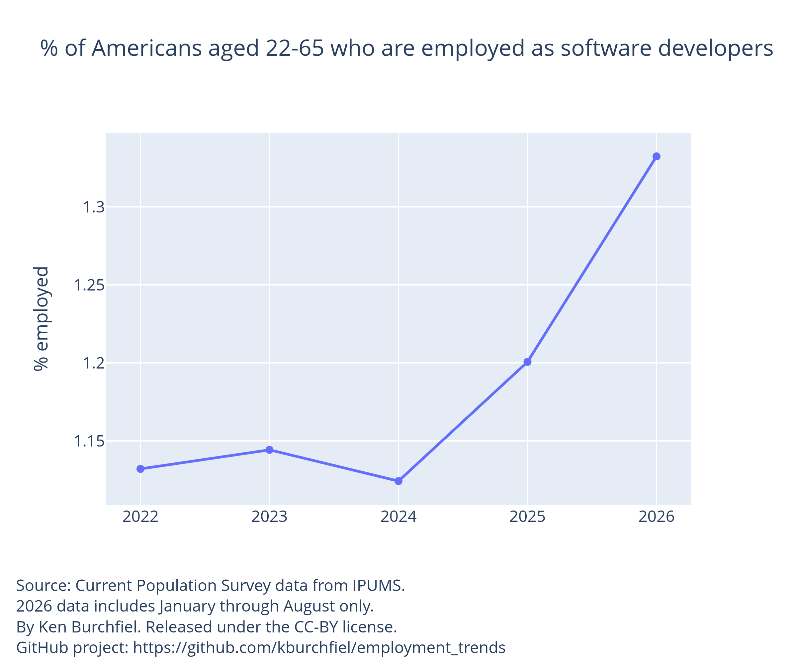

# CPS data indicates that US software-developer employment has increased since 2022

By Ken Burchfiel

Released under the CC-BY license

*Note: I did not use generative-AI tools for any part of this project, including my code, my visualizations, and this blog post.*

## Introduction and methodology

In order to assess whether software-developer employment has been increasing or decreasing since ChatGPT was released in 2022, I downloaded Current Population Survey data from IPUMS, then analyzed it in Python using the [svy](https://svylab.com/docs/svy/) library. (The CPS was also the survey of choice for [a similar analysis](https://www.wsj.com/economy/jobs/tech-has-never-caused-a-job-apocalypse-dont-bet-on-it-now-d192b579?mod=economy_lead_story) conducted by James Bessen at Boston University; his work helped inspire my own analysis project. My analysis focuses only on the 'Software developers, applications and system software' occupation category, and not on other related fields, such as web developers and computer programmers.

The strata, PSUs, and weights that I used for my survey sample were based on [guidance from Ivan Strahof at IPUMS](https://forum.ipums.org/t/calculating-standard-errors-using-cps-basic-monthly-microdata/6408/7), whose recommendations were in turn based in part on [a 2007 research paper by Michael Davern et al](https://journals.sagepub.com/doi/epdf/10.5034/inquiryjrnl_44.2.211). I may revise these in the future, though, as it is possible that they still still underestimate the actual sampling error present within the CPS.

Interactive versions of my calculations are available within [this interactive dashboard](https://kburchfiel.github.io/employment_trends/occ_dashboard.html). This blog post, however, will show PNG-based charts in order to make it easier to share them.

If you'd like to review and/or repurpose the code that I used for this analysis, you can find it [within this GitHub project](https://github.com/kburchfiel/employment_trends). 

## Findings

### Yearly employment trends

My analyses indicate that software-developer employment has increased from around 2 million in 2022 to over 2.5 million in 2026. (2026 data is current through August.)

The following chart displays 95% confidence intervals together with point estimates. Note that the intervals for 2022 and 2026 do not overlap, meaning we can be confident that the increase in employment over that time is statistically significant.

### Monthly employment trends

Since the CPS is normally administered each month, we can also assess trends on a monthly level. These should be interpreted with caution, as monthly confidence intervals will be larger than yearly ones. However, the *upper* bound of the confidence interval for November 2022 (2,289,355) is still lower than the *lower* bound of the August 2026 confidence interval (2,419,564). As a result, we can conclude that software-developer employment has increased from ChatGPT's release [on November 30, 2022](https://en.wikipedia.org/wiki/ChatGPT) to the present date.

Here's the same chart without error bars:

(Note: You can hover over points on charts within [my interactive dashboard](https://kburchfiel.github.io/employment_trends/occ_dashboard.html) in order to view actual confidence-interval and point-estimate values.)

### Yearly employment by age range

It's challenging to use CPS data to draw conclusions about employment trends for a given occupation and age range, as the number of respondents for a given month who fall into a particular age range/occupation group may be quite small. Nonetheless, I thought it would be interesting to compare CPS estimates by age in order to see whether employment growth has been particularly large or small for certain groups.

Here's a look at the data. (The overlapping error bars make this chart quite hard to read, but within the [interactive dashboard](https://kburchfiel.github.io/employment_trends/occ_dashboard.html), you can select or deselect certain age ranges to allow for easier comparisons.) 

For two age ranges (30-34 and 40-44), the *lower* confidence interval of the 2026 estimate is higher than the *upper* confidence interval of the 2022 estimate, which indicates that these two age ranges have seen a significant increase in software-developer employment since 2022. For all other age ranges, we can't conclude that a significant increase *or* decrease has occurred.

Here's a copy of the following chart that does not include error bars:

## Assessing the growth in the percentage of Americans who are employed as software developers

Another way to evaluate software-development's growth is to estimate the percentage of Americans who are employed as a developer. This approach adjusts for growth in the US population; in addition, it allows for logistic-regression tests that allow us to assess whether two differences in proportions are statistically significant.

The average percentage of Americans employed as software developers for January through August 2026 is 1.33%. This is significantly higher than the % employed in each year from 2022 through 2025. (The 2022 percentage was 1.13%).

Here's the same graph without error bars:

## Conclusion and next steps

Although I still need to double-check these analyses, it appears that the overall trend in software-development since 2022 has been positive, particularly for those ages 30-34 and 40-44. This suggests that the introduction of generative-AI tools has not actually led to a reduction in software-developer employments.

In the coming days and weeks, I hope to add the following content to this blog post (or a subsequent post):

1. Results from logistic regressions that show whether the *proportion* of Americans in the CPS sample who are employed as software developers has increased significantly since 2022

2. Data on changes in unemployment rates for software developers.

3. Results from the American Community Survey, which offers a much larger sample (and thus greater statistical power), but less recent data. (Currently, ACS data is only available through 2024.)

In addition, I plan to use R-based libraries to check these statistics.

IPUMS CPS citation:

*Sarah Flood, Miriam King, Renae Rodgers, Steven Ruggles, J. Robert Warren, Daniel Backman, Etienne Breton, Grace Cooper, Julia A. Rivera Drew, Stephanie Richards, David Van Riper. Integrated Public Use Microdata Series, Current Population Survey: Version 13.0 [dataset]. Minneapolis, MN: IPUMS, 2025. https://doi.org/10.18128/D030.V13.0*
